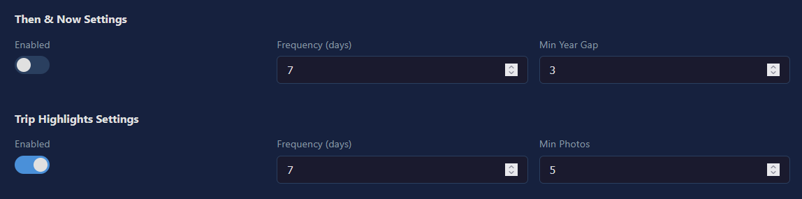
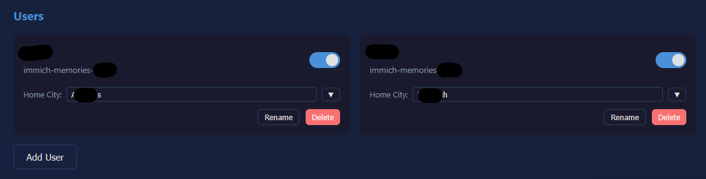

# Immich Memories Notify

Get daily push notifications when you have photo memories in [Immich](https://immich.app/) - just like Google Photos!

**⭐ NEW in v2.1:** Beautiful weekly collages with 12 template combinations! [Jump to Collage Feature →](#-weekly-collage-feature-v21)

## Contents

- [Features](#features)
- [How It Works](#how-it-works)
- [Quick Start](#quick-start)
- [Web Dashboard](#web-dashboard)
- [Usage](#usage)
- [Configuration](#configuration)
- [Multi-User Setup](#multi-user-setup)
- [Self-Hosting ntfy](#self-hosting-ntfy)
- [Weekly Collage Feature](#-weekly-collage-feature-v21)
- [Troubleshooting](#troubleshooting)
- [Development](#development)
- [Contributing](#contributing)

## Features

- **Daily Memory Notifications** - Get notified when you have photos from this day in previous years
- **Face Preference** - Prefers photos with recognized faces (your top 5 named people)
- **Group Photo Priority** - Prioritizes photos with 2+ named people
- **Person Photos** - Random photos of your favorite people when no memories exist
- **Location Context** - Shows city/country when available (33% chance)
- **Album Awareness** - Displays album name when photo is in an album
- **Video Support** - Different emoji (🎬) and message templates for videos
- **Smart Scheduling** - Multiple notification slots with random timing within configurable windows
- **Web Dashboard** - Browser-based UI to manage settings, users, and trigger tests
- **Cozy Messages** - Randomized warm message templates (customizable)
- **Multi-User Support** - Each user gets their own top people and personalized notifications
- **Rich Notifications** - Includes thumbnail preview with person names
- **Click to Open** - Tap notification to open photo directly in Immich
- **Guided Setup** - Interactive `setup.sh` script and first-run dashboard wizard
- **Bundled ntfy** - Optionally spin up a pre-configured ntfy server automatically
- **Self-Hosted** - Works with your self-hosted Immich and ntfy instances
- **Docker Ready** - Easy deployment with Docker Compose
- **Privacy First** - Your photos never leave your network
- **Then & Now (NEW v2.2)** - Side-by-side comparison of the same person across years
- **Trip Highlights (NEW v2.2)** - Collage from a past trip to the same city, same month
  - Fuzzy home city matching (handles EXIF transliteration variants)
  - 5-day date clustering (only groups photos taken close together)
  - City picker from Immich photo EXIF data
- **Weekly Collages (v2.1)** - Beautiful collages with 12 professional template combinations
  - 4 templates: Grid, Mosaic, Polaroid, Strip
  - 3 unique overlays per template
  - Face-based smart cropping
  - Random or manual template selection
  - Photoshop-customizable backgrounds

## How It Works

```
┌─────────────┐      ┌─────────────┐      ┌─────────────┐
│   Immich    │ ───> │   Script    │ ───> │    ntfy     │
│   Server    │      │  (Python)   │      │   Server    │
└─────────────┘      └─────────────┘      └─────────────┘
                            │                    │
                            ▼                    ▼
                     ┌─────────────┐      ┌─────────────┐
                     │  Dashboard  │      │  Mobile App │
                     │  (Web UI)   │      │ Notification│
                     └─────────────┘      └─────────────┘
```

### Notification Logic

| Scenario | Slots 1-3 | Slot 4 |
|----------|-----------|--------|
| Has memories today | Memory photo (prefers faces) | Random person photo |
| No memories today | Random person photo | Random person photo |

**Key features:**
- Photos with recognized faces from your top 5 named people are prioritized
- Group photos (2+ named people) get highest priority
- Person photos exclude the last 30 days (configurable)
- Each slot sends at a random time within its window (e.g., 8-10 AM)
- Per-user top people based on their own photo library
- Location and album info added when available

## ✨ Weekly Collage Feature (v2.1)

**NEW in v2.1:** Hybrid custom template system with beautiful overlay designs!

Instead of receiving individual photos, users can receive weekly photo collages featuring their top people. The system now includes 4 professional templates with 3 unique overlay variants each — **12 stunning combinations** that rotate randomly.

### Features

- **🎨 12 Beautiful Combinations** - 4 templates × 3 overlays, randomly selected
- **🖼️ Professional Templates**
  - **Grid** (3×2) - Clean 6-photo layout
  - **Mosaic** (1 large + 6 small) - Hero photo with supporting cast
  - **Polaroid** (5 photos) - Scattered photos with rotation
  - **Strip** (3 photos) - Vertical magazine-style layout
- **👤 Face-Based Smart Cropping** - Photos are intelligently cropped to keep faces centered
- **🎭 Custom Overlay Support** - Each template includes decorative overlays designed in Photoshop
- **📐 JSON-Driven Layouts** - Precise control over photo positions, sizes, and rotation
- **🔄 Transparent Rotation** - Photos can overlap naturally without rectangular cutouts
- **📅 Configurable Schedule** - Choose which day of the week to receive collages
- **📁 Auto-Upload to Immich** - Collages are saved to a named album for easy access
  


### How It Works

1. **Schedule**: Configure a specific day of the week (e.g., Thursday = 4, where 0=Sunday, 6=Saturday)
2. **Generation**: On the selected day, the system:
   - Finds photos of your top people from across multiple years
   - Uses face detection data to intelligently crop photos
   - Selects a random template and overlay combination
   - Generates a beautiful 1920×1920px collage
3. **Delivery**: Collage is uploaded to Immich album and sent as a rich notification

### Configuration

```yaml
settings:
  weekly_collage_enabled: true
  weekly_collage_day: 4              # Thursday (0=Sunday, 6=Saturday)
  weekly_collage_slots: 2            # Number of slots for collages
  collage_person_limit: 7            # Max people in collage (for mosaic)
  year_range: 20                     # Look back 20 years (used by collage, trip highlights, then & now)
  collage_template: random           # or: grid_custom, mosaic_custom, polaroid_custom, strip_custom
  collage_album_name: Weekly Highlights
```

### Dashboard Integration

All collage settings are available in the web dashboard:
- **Settings Tab** → Collage section
  - Enable/disable collages
  - Choose template (random or specific)
  - Configure day, person limit, year range
  - Set album name
- **Test Tab** → Trigger test collage generation

### Customization

Advanced users can create custom backgrounds and overlays:
- Edit backgrounds in Photoshop (1920×1920px PNG)
- Design decorative overlays (transparent PNG)
- Modify photo positions via JSON layouts
- See `custom_templates/` directory for templates and guides

## Requirements

- [Immich](https://immich.app/) server (self-hosted)
- [ntfy](https://ntfy.sh/) server (self-hosted or use ntfy.sh)
- Docker & Docker Compose (recommended) OR Python 3.8+
- ntfy mobile app ([Android](https://play.google.com/store/apps/details?id=io.heckel.ntfy) / [iOS](https://apps.apple.com/app/ntfy/id1625396347))
- **Named people in Immich** - For face preference and person photos, name your frequently appearing people in Immich

### For Weekly Collages (Optional)
- **Pillow (PIL)** - Image processing library, included in Docker image
- **Named faces in Immich** - Face detection data is used for smart cropping
- If running without Docker: `pip install Pillow`

## Disclaimer

Built this mostly vibe coding! Been running smoothly on my setup. PRs and feedback welcome!

## Quick Start

```bash
git clone https://github.com/ismaildakrory/immich-memories-notify.git
cd immich-memories-notify
bash setup.sh
```

The setup script asks a few questions, generates your config files, and starts the services. Then open the dashboard — a guided wizard walks you through the rest.

### What `setup.sh` does

1. Asks for your **Immich URL** and **timezone**
2. Asks whether to use **bundled ntfy** (spins up a pre-configured ntfy container automatically) or your own
3. Generates your **`.env`** file with all URLs pre-filled
4. If bundled ntfy: generates **`docker-compose.override.yml`** and **`ntfy_config/server.yaml`** with attachment support enabled
5. Offers to **start the services immediately**

### First-run wizard

On first visit to the dashboard (`http://your-server:5000`), a setup wizard guides you through:

| Step | What it does |
|------|-------------|
| 1 — Immich | Enter internal/external URLs, test connection |
| 2 — ntfy | Enter ntfy URLs, test connection |
| 3 — Add user | Name, ntfy topic, Immich API key — plus optional auto-create of ntfy user if using bundled ntfy |
| 4 — Done | Summary + scheduler start command |

The wizard only appears once. After completion it won't show again.

### Get your Immich API key

In Immich → **Account Settings** → **API Keys** → create a new key.

### Subscribe to ntfy

Open the ntfy app on your phone and subscribe to the topic you chose in Step 3 (e.g. `immich-alice`) on your ntfy server.

### Start the scheduler

```bash
docker compose up -d scheduler
```

### Rebuilding after updates

```bash
docker compose down dashboard && docker compose up -d --build dashboard
```

## Web Dashboard

Access the dashboard at `http://localhost:5000` to manage your setup through a browser interface.

### Features

- **Status Tab** - View today's sent notifications per user
- **Settings Tab** - Edit notification windows, manage users, toggle features
- **Messages Tab** - Customize message templates
- **Secrets Tab** - View/edit API keys and passwords (masked display)
- **Test Tab** - Trigger test notifications for any slot

### Screenshots





### Authentication

Set `DASHBOARD_TOKEN` in `.env` to enable authentication:

```bash
DASHBOARD_USER=admin
DASHBOARD_TOKEN=your-secret-token
```

If not set, the dashboard is open (suitable for local network use).

### Auto-Restart

When you save notification windows or secrets through the dashboard, the scheduler automatically restarts to apply changes.

## Usage

### Docker Commands

```bash
# Run a specific slot
docker compose run --rm notify --slot 1

# Test mode (uses any available date with memories)
docker compose run --rm notify --slot 1 --test

# Preview without sending (dry run)
docker compose run --rm notify --slot 1 --dry-run

# Skip random delay, send immediately
docker compose run --rm notify --slot 1 --no-delay

# Force send even if already sent today
docker compose run --rm notify --slot 1 --force

# Check specific date
docker compose run --rm notify --slot 1 --date 2024-12-25

# Start scheduler (runs all slots daily)
docker compose up -d scheduler

# Start dashboard
docker compose up -d dashboard

# View logs
docker compose logs -f scheduler
docker compose logs -f dashboard

# Stop services
docker compose down

# Rebuild after updates (must recreate container for volume mounts)
docker compose down dashboard && docker compose up -d --build dashboard
```

### Without Docker

```bash
# Install dependencies
pip install requests pyyaml Pillow

# Run
python notify.py --slot 1 --test --no-delay
```

## Configuration

### File Structure

| File | Purpose |
|------|---------|
| `.env` | **Secrets only** - API keys, passwords, server URLs |
| `config.yaml` | **All configuration** - users, schedules, settings, messages |
| `state/state.json` | Tracks sent notifications (auto-generated) |
| `dashboard/` | Web dashboard (FastAPI + HTML) |

### Notification Windows

Each slot triggers at the window start time, then sends at a random time within that window:

| Slot | Window | Purpose |
|------|--------|---------|
| 1 | 08:00-10:00 | Memory or person photo |
| 2 | 12:00-14:00 | Memory or person photo |
| 3 | 16:00-18:00 | Memory or person photo |
| 4 | 19:00-20:00 | Person photo (when memories exist) |

Configure windows in `config.yaml`:
```yaml
notification_windows:
  - start: "08:00"
    end: "10:00"
  # Add more as needed...
```

### Settings Reference

```yaml
settings:
  # Notification counts
  memory_notifications: 3       # Max memory notifications per day
  person_notifications: 1       # Person photo notifications (when memories exist)
  fallback_notifications: 3     # Person photos when no memories today

  # Person photo settings
  top_persons_limit: 5          # Consider top N named people
  exclude_recent_days: 30       # Skip photos from last N days

  # Enhanced features
  include_location: true        # Add city/country (33% random chance)
  include_album: true           # Show album name when in album
  video_emoji: true             # Add 🎬 emoji for video notifications
  prefer_group_photos: true     # Prioritize photos with multiple people
  min_group_size: 2             # Minimum faces for "group photo"

  # Retry settings
  retry:
    max_attempts: 3
    delay_seconds: 5

  # Other
  state_file: "state/state.json"
  log_level: "INFO"             # DEBUG, INFO, WARNING, ERROR
```

### Message Templates

Messages are randomly selected from customizable templates:

```yaml
# For "On This Day" memories
messages:
  - "A little trip back to {year}..."
  - "Remember this day {years_ago} years ago?"
  - "Throwback to {year}! Take a moment to smile"

# For random person photos
person_messages:
  - "A lovely moment with {person_name}..."
  - "Remember this time with {person_name}?"
  - "Here's a favorite moment with {person_name}"

# For video memories
video_messages:
  - "Watch this moment from {year}..."
  - "A video memory from {years_ago} years ago"

# For videos with people
video_person_messages:
  - "Watch this moment with {person_name}..."
  - "A video featuring {person_name} from {year}"
```

**Placeholders:**
- `{year}` - The year (e.g., 2020)
- `{years_ago}` - Years since (e.g., 4)
- `{person_name}` - Person's name from Immich

**Auto-appended context (when available):**
- Location: `📍 Cairo, Egypt` (33% chance)
- Album: `📁 Summer Vacation 2023`

## Multi-User Setup

Each user gets personalized notifications based on their own Immich library.

**First user:** handled by the setup wizard (Step 3).

**Additional users via Dashboard:**
1. **Settings tab** → **Add User** → enter name and ntfy topic
2. **Secrets tab** → add the user's Immich API key and ntfy password

**Additional users manually:** edit `config.yaml` and `.env`, then restart the scheduler.

Each user subscribes to their own ntfy topic in the app.

## Self-Hosting ntfy

### Option A — Bundled ntfy (easiest)

When `setup.sh` asks *"Use bundled ntfy?"*, say **yes**. It will:
- Add a ntfy service to your Docker Compose automatically
- Generate `ntfy_config/server.yaml` with attachment support pre-configured
- The dashboard wizard (Step 3) creates ntfy users and grants access for you

```bash
# After setup.sh, start ntfy:
docker compose up -d ntfy
```

### Option B — Bring your own ntfy

If you already have ntfy running elsewhere, say **no** in setup.sh and enter your server URLs.

For thumbnail previews to work, your ntfy `server.yaml` needs:

```yaml
# Must be your externally reachable URL — not localhost
base-url: "https://notify.yourdomain.com"

# Auth (required for attachment uploads on most setups)
auth-file: /var/lib/ntfy/user.db
auth-default-access: deny-all

# Attachment storage
attachment-cache-dir: /var/lib/ntfy/attachments
attachment-total-size: 5G
attachment-file-size: 15M
attachment-expiry-duration: 3h
```

Create a user and grant read-write access:
```bash
ntfy user add <username>          # prompts for password
ntfy access <username> '*' read-write
```

Then install the ntfy app on your phone and add your server.

## Troubleshooting

### No notifications received

1. Check if you have memories for today: `docker compose run --rm notify --slot 1 --dry-run --no-delay`
2. Verify ntfy subscription in the app
3. Check logs: `docker compose logs scheduler`

### No thumbnail previews

Notifications arrive but without the photo preview. Run a test — the script will log exactly where it fails:

```bash
docker compose run --rm notify --slot 1 --test --no-delay --force
```

Look for a warning in the output. You'll see one of the following, each with a different fix:

**`ntfy upload failed: 401` or `403`** — ntfy rejected the upload due to permissions. By default, ntfy may require an admin account to upload attachments. Grant upload permissions to your user:
```bash
ntfy access <username> --upload
```

**`ntfy upload failed: {other status}`** — the upload was rejected for another reason. Verify your ntfy username/password in `.env` and that your server allows PUT requests.

**`ntfy upload returned 200 but no attachment URL`** — the upload went through but ntfy didn't return an attachment URL. Attachment hosting is not enabled on your ntfy server. Add the following to your ntfy `server.yaml` (update `base-url` to your actual domain — not localhost):
```yaml
base-url: "https://notify.yourdomain.com"
attachment-cache-dir: "/var/cache/ntfy/attachments"
attachment-total-size-limit: "1G"
attachment-file-size-limit: "15M"
attachment-expiry-duration: "3h"
```
Then restart ntfy and rerun the test.

**`Thumbnail upload failed for topic '...' — notification will be sent without preview (X bytes attempted)`** — check the byte count at the end. If it exceeds your `attachment-file-size-limit`, increase that value in your ntfy config. The `15M` default above is more than enough for thumbnails.

**No warnings appear** — the upload is succeeding on the server side. The issue is on the receiving end. Check your ntfy app settings, notification channel config, or device notification permissions.

### No person photos

1. Make sure you have **named people** in Immich (People → click face → add name)
2. Check you have photos older than 30 days for those people
3. Verify with: `docker compose run --rm notify --slot 4 --dry-run --no-delay`

### API key errors

1. Verify your API key in Immich web UI
2. Make sure the key has "Read" permissions
3. Check environment variable is set correctly in `.env`

### Already sent today

The script tracks sent notifications per slot to avoid duplicates. To resend:
```bash
docker compose run --rm notify --slot 1 --force --no-delay
```

Or delete `state/state.json` to reset all slots.

### Dashboard not loading

1. Check if container is running: `docker compose ps`
2. View logs: `docker compose logs dashboard`
3. Verify port 5000 is accessible

## Development

Source files are mounted as volumes, so you can edit them without rebuilding:

```
.
├── setup.sh               # First-run interactive setup script
├── notify.py              # Main notification script
├── config.yaml            # Configuration (users, schedules, settings)
├── .env                   # Secrets only (API keys, passwords, URLs)
├── state/
│   └── state.json         # Tracks sent notifications (auto-generated)
├── Dockerfile             # Main container definition
├── Dockerfile.dashboard   # Dashboard container
├── docker-compose.yml     # Service definitions
├── docker-compose.override.yml  # Generated by setup.sh (bundled ntfy)
├── ntfy_config/           # Generated by setup.sh (bundled ntfy)
│   └── server.yaml        # ntfy server configuration
└── dashboard/             # Web dashboard
    ├── main.py            # FastAPI app
    ├── models.py          # Pydantic models
    ├── routers/           # API endpoints
    └── templates/         # HTML UI
```

After editing, changes take effect immediately on next run. For dashboard changes, rebuild with:
```bash
docker compose up -d --build dashboard
```

## Contributing

Contributions are welcome! Please feel free to submit a Pull Request.

1. Fork the repository
2. Create your feature branch (`git checkout -b feature/amazing-feature`)
3. Commit your changes (`git commit -m 'Add amazing feature'`)
4. Push to the branch (`git push origin feature/amazing-feature`)
5. Open a Pull Request

## License

This project is licensed under the MIT License - see the [LICENSE](LICENSE) file for details.

## Acknowledgments

- [Immich](https://immich.app/) - The amazing self-hosted photo solution
- [ntfy](https://ntfy.sh/) - Simple push notification service
- Inspired by Google Photos' "Memories" feature

---

**Made with love for the Immich community**
